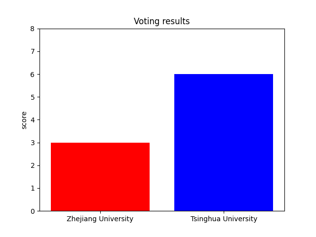

# Terminal Voting in LAN


## What's this？

**This is a terminal program used to count the results of a certain vote in a local area network.**

The program is based on the **TCP** protocol in the local area network, so it is divided into two parts: the **client** program and the **server** program. The client program is used for voting, and the server program is used for receiving voting results and giving visual results.


## How to use?

0. Make sure you have **python 3** and **matplotlib** module installed in your environment.

1. Select a device in the LAN to run the server program (you should know the IPv4 address of this device), and start the terminal under the project directory.Enter the following line of command:

```shell
python ./server_src/main.py
```

2. Follow the prompts of the program to set the options and start voting.
3. Inform those participants of the IPv4 address of the selected device, and have them run the client program with the following command:

```
python ./client_src/main.py
```

4. After the voter enters the IP address correctly, the voting option will be displayed on their device, and they need to enter a legal serial number (otherwise the vote will be invalid)
5. After the time set by the server is up, the client can no longer vote. The server will count the results and draw a visual image. You can find png files in the directory. It might look like this:




## Weaknesses and areas for improvement

1. There is no IP checking function, which means that the same device can vote multiple times during the voting time. Because of the limited equipment in hand during the test, it is difficult to verify this feature even if it is added.
2. Compared to the first problem, the second problem seems to be more serious. Now the program can indeed guarantee that the vote after the timeout will not be recorded, but if everyone completes the vote within the specified time, the program will not be able to continue because of the block waiting for the connection.The solution I am currently using is to execute the client program once with the computer selected as the server after the time is over, so that the server program can run normally.